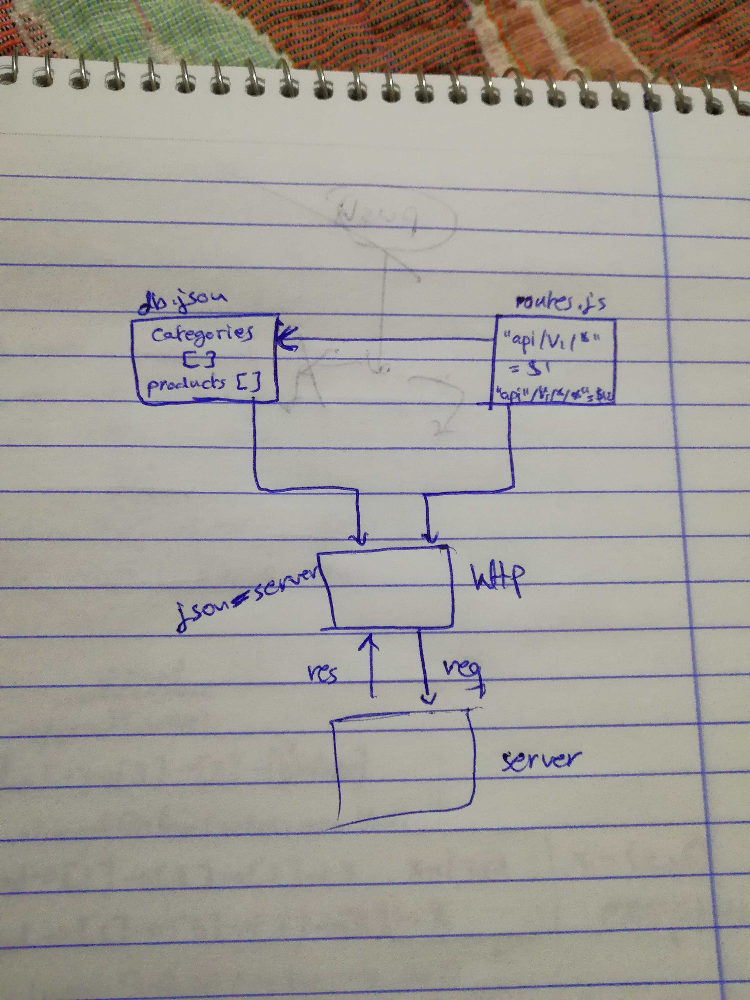

# LAB - Class 03

# simple-api

### Author: 
Ahmad K. Al-Mahasneh 

### Links and Resources

- [submission PR](https://github.com/401-advanced-javascript-AhmadK/simple-api/pull/1) (Pull Request)
- [ci/cd](https://github.com/401-advanced-javascript-AhmadK/simple-api/actions) (GitHub Actions) (no tests)

#### How to initialize/run your application (where applicable)

  `npm run start`

#### Tests

- How do you run tests?
     - 'npm run test'
- Any tests of note?
     - jest --verbose --coverage
- Describe any tests that you did not complete, skipped, etc
     - the test for the returned updated content. 

#### UML
